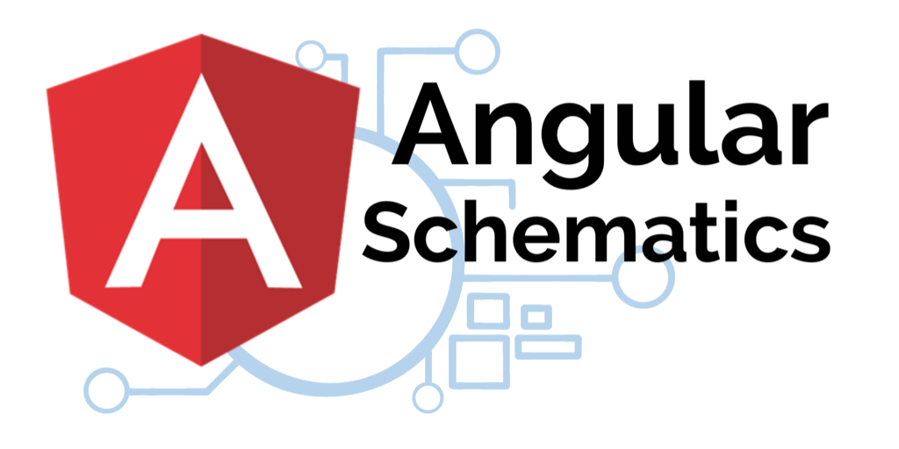

# Angular Schematics — Criando Projetos Customizados

Este é um projeto de demonstração usado como apoio para o artigo abaixo:

## Clique na Imagem pra abrir o Artigo

[](https://gleisonsubzerokz.medium.com/angular-schematics-criando-projetos-customizados-edf89fd434dd)

### Testing

Para testar localmente, instale o `@angular-devkit/schematics-cli` de forma global e use o comando `schematics`, Essa ferramente age da mesma forma que o comando `generate` do Angular CLI, mas também tem um modo de debug.

Dúvidas utilize o comando

```bash
schematics --help
```

### Unit Testing

`npm run test` irá executar os testes unitários utilizando o Jasmine como runner e framework de teste.
